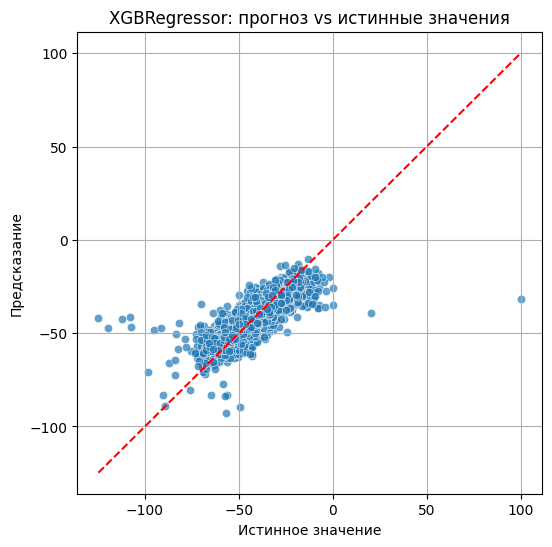
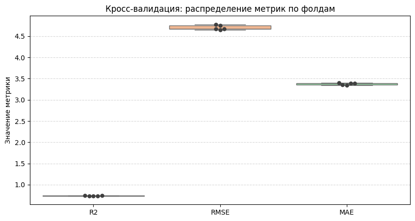
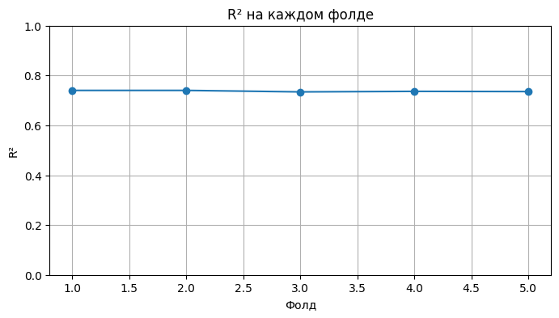

# Drug Discovery Regression

## Описание проекта
В данном проекте обучались модели такие как XGBoost, Lightgbm, Randomforest, CatBoost, MLP, для задачи предсказания относительной силы взаимоействия малой молекулы с ферментом ALDR

## Подготовка датасета
Фичи которые были рассчитаны:
1) физико-химические признаки (растворимость и тд)
2) топологические признаки
3) площади поверхности по диапазонам гидрофобности, площади поверхности по диапазонам мол. рефрактивности, площади поверхности по диапазонам частичных зарядов
4) Количество функциональных групп

Также были рассчитаны фингрепринты MACCS и Morgan fingerprints

Ноутбук рассчета фичей: calculate_features/features.ipynb

## Работа с датасетом
Для подачи в модель были сделаны следующие операции:
1) Стандартизация фичей
2) Удаление сильно коррелирующих признаков, с помощью коэффициента корреляции Спирмена (порог был 0.9)

*Датасет, который был построен только на фингерпринтах не поддавался обработке

## Результаты моделей

**Модель XGBoost, кооторая обучалась на фингерпринтах MACCS:**

Полученные метрики с кросс валидацией:

Mean R^2 : 0.6584 ± 0.0063

Mean RMSE: 5.3753 ± 0.0474

**Модель XGBoost, кооторая обучалась на фингерпринтах Morgan:**

Полученные метрики с кросс валидацией:

Mean R^2 : 0.7082 ± 0.0076

Mean RMSE: 4.9682 ± 0.0676

**Модель XGBoost, которая обучалась только на фичах c пяти независимыми наборами данных**

Полученные метрики с кросс валидацией:

Средний R² : 0.737 ± 0.002

Средний RMSE: 4.704 ± 0.051
