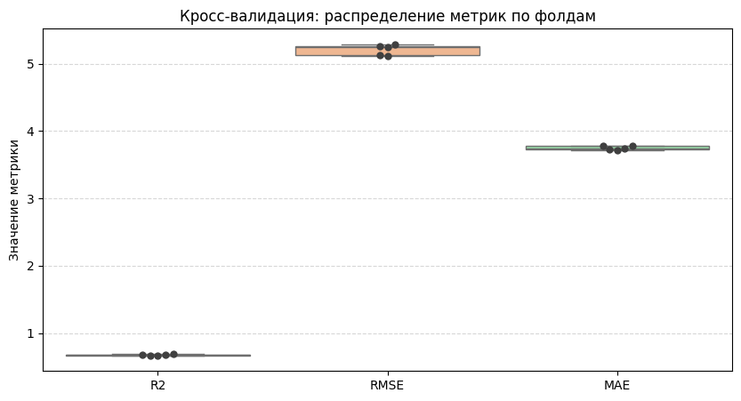
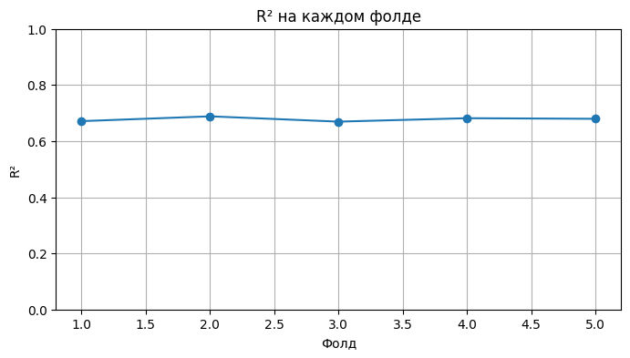
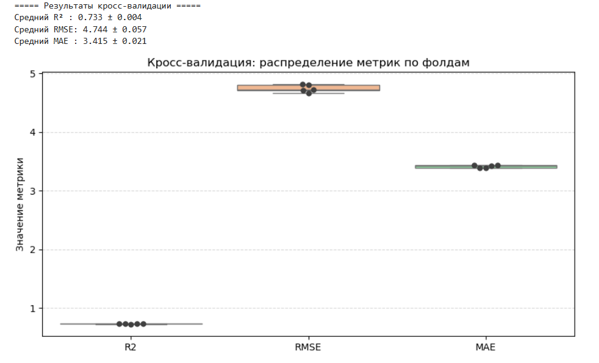
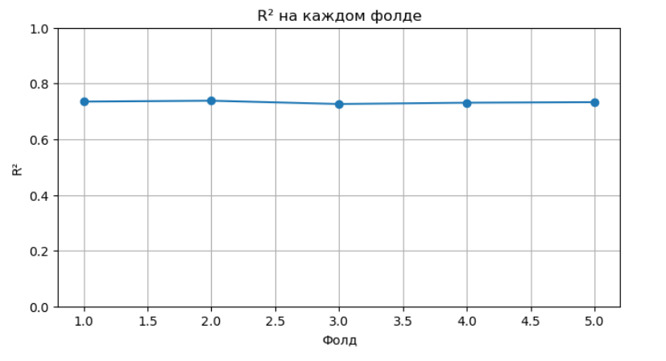
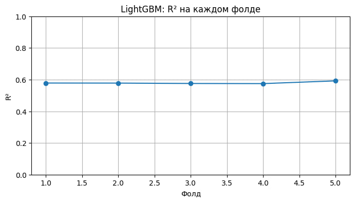
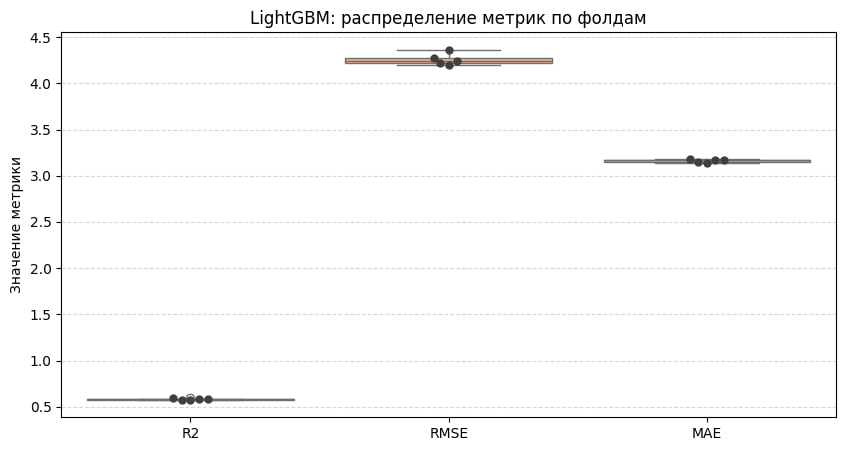
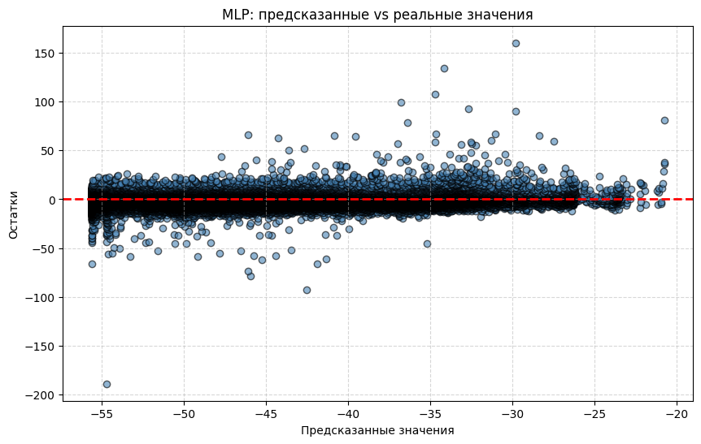

# Drug Discovery Regression

## Описание проекта
В данном проекте обучались модели такие как XGBoost, Lightgbm, Randomforest, CatBoost, MLP, для задачи предсказания относительной силы взаимоействия малой молекулы с ферментом ALDR

## Подготовка датасета
Фичи которые были рассчитаны:
1) физико-химические признаки (растворимость и тд)
2) топологические признаки
3) площади поверхности по диапазонам гидрофобности, площади поверхности по диапазонам мол. рефрактивности, площади поверхности по диапазонам частичных зарядов
4) Количество функциональных групп

Также были рассчитаны фингрепринты MACCS и Morgan fingerprints

Ноутбук рассчета фичей: calculate_features/features.ipynb

## Работа с датасетом
Для подачи в модель были сделаны следующие операции:
1) Стандартизация фичей
2) Удаление сильно коррелирующих признаков, с помощью коэффициента корреляции Спирмена (порог был 0.9)

*Датасет, который был построен только на фингерпринтах не поддавался обработке

## Результаты моделей

**Модель XGBoost, кооторая обучалась на фингерпринтах MACCS:**

Полученные метрики с кросс валидацией:

Mean R^2 : 0.6584 ± 0.0063

Mean RMSE: 5.3753 ± 0.0474

**Модель XGBoost, кооторая обучалась на фингерпринтах Morgan:**

Полученные метрики с кросс валидацией:

Mean R^2 : 0.7082 ± 0.0076

Mean RMSE: 4.9682 ± 0.0676

**Модель XGBoost, которая обучалась только на фичах c пяти независимыми наборами данных**

Полученные метрики с кросс валидацией:

Средний R² : 0.737 ± 0.002

Средний RMSE: 4.704 ± 0.051

**Модель RandomForest, которая обучалась только на фичах c пяти независимыми наборами данных**

Полученные метрики с кросс валидацией:

Средний R² : 0.678 ± 0.007

Средний RMSE: 5.210 ± 0.074

**Модель Catboost, которая обучалась только на фичах c пяти независимыми наборами данных**

Полученные метрики с кросс валидацией:

Средний R² : 0.733 ± 0.004

Средний RMSE: 4.744 ± 0.057

**Модель LightGBM, которая обучалась только на фичах c пяти независимыми наборами данных**

Полученные метрики с кросс валидацией:

Средний R² : 0.580 ± 0.006

Средний RMSE: 4.258 ± 0.059

**Модель MLP, которая обучалась только на фичах c пяти независимыми наборами данных**

Полученные метрики с кросс валидацией:

Средний R² : 0.631 ± 0.017

Средний RMSE: 5.570 ± 0.113

# Сравнение моделей для предсказания `score`

В проекте протестированы различные модели машинного обучения на разных типах признаков:

- **Химические фингерпринты**:  
  - **MACCS**  
  - **Morgan**
- **Специально подготовленные химические фичи** (5 независимых наборов признаков)

## Результаты 5-фолдовой кросс-валидации

| Модель        | Признаки                             | Средний R² ↑ | Средний RMSE ↓ |
|---------------|---------------------------------------|--------------|---------------|
| **XGBoost**   | MACCS фингерпринты                   | **0.658**    | **5.38**      |
| **XGBoost**   | Morgan фингерпринты                  | **0.708**    | **4.97**      |
| **XGBoost**   | Специальные химические фичи          | **0.737**    | **4.70**      |
| RandomForest  | Специальные химические фичи          | 0.678        | 5.21          |
| CatBoost      | Специальные химические фичи          | 0.733        | 4.74          |
| LightGBM      | Специальные химические фичи          | 0.580        | 4.26*         |
| MLP (нейросеть)| Специальные химические фичи         | 0.631        | 5.57          |

\*Низкий RMSE при низком R² у LightGBM указывает на слабую объясняющую способность модели
(вероятно, недообучение или неоптимальные гиперпараметры).

---

## Основные выводы

* **Лучшие результаты** показали модели **XGBoost** и **CatBoost**, обученные на специально подготовленных химических фичах:  
  - **XGBoost**: R² ≈ **0.74**, RMSE ≈ **4.70**  
  - **CatBoost**: R² ≈ **0.73**, RMSE ≈ **4.74**  

* **Morgan-фингерпринты информативнее MACCS**:  
  переход от MACCS к Morgan улучшил R² с 0.66 до 0.71.

* **Инженерия признаков важнее архитектуры**:  
  специально подготовленные химические фичи оказались полезнее, чем использование только фингерпринтов.

* **LightGBM** требует дополнительного тюнинга (`num_leaves`, `min_data_in_leaf`, `feature_fraction`), чтобы раскрыть потенциал.

* **Нейронная сеть (MLP)** показала худшие метрики и требует увеличения объёма данных и подбора гиперпараметров.

---

## Рекомендации по дальнейшей работе

1. **Комбинировать признаки**: объединить Morgan-фингерпринты с химическими фичами (например, через PCA-сжатие + конкатенацию).
2. **Энсемблирование**: попробовать стекинг или усреднение лучших моделей (XGBoost + CatBoost) для снижения RMSE.
3. **Глубокий тюнинг LightGBM** для честного сравнения.

> **Вывод:** На текущем этапе **XGBoost с расширенным набором химических признаков** — оптимальный выбор
для предсказания целевого `score`.
